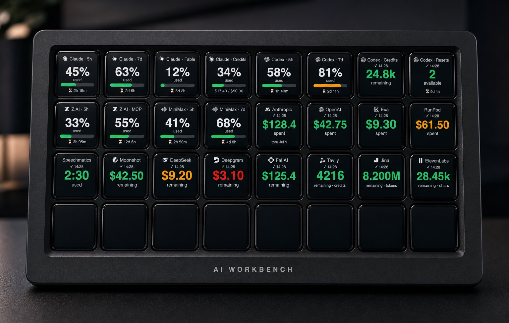

# AI Workbench

A local macOS **Stream Deck plugin** that puts live AI-tooling **usage**, account **balances**, and public provider **incident status** on your Stream Deck keys. The current catalog implements plan usage for five AI coding tools, balance/spend/credit/token/character/used-time metrics for thirteen AI API vendors, and active-incident status for four providers.



*A fully configured Stream Deck XL running AI Workbench — sample data, not real account values.*

> **Personal / educational project.** It is **not affiliated with, endorsed by, or supported by** any of the vendors it integrates with. Usage and Balance integrations use **your own credentials**; Status reads public provider status feeds without credentials. Several integrations rely on **undocumented endpoints** that can change or break at any time. See [Disclaimers](#disclaimers--legal) before using or distributing it.

---

## Current status

- **Plugin version:** `0.2.0.14`
- **Actions:** Usage, Balance, and Status
- **Implemented catalog:** 5 Usage providers, 13 Balance providers, and 4 Status providers
- **Distribution:** this repository's install path is a source build linked into Stream Deck
- **Platform:** macOS 14+, Stream Deck 7.1+, and Stream Deck's bundled Node 24 runtime

Every provider listed below has an implemented, selectable adapter. That does not make the upstream endpoints stable: several usage and billing integrations depend on vendor behavior that is undocumented, privileged, or subject to change.

## What it is

AI Workbench is a self-hosted Stream Deck plugin you build and install yourself. It adds three action types to Stream Deck:

- **Usage** — rolling plan-window percentages plus provider-specific categories such as credits, reset credits, and extra-usage spend.
- **Balance** — an AI API vendor's remaining balance, or its month‑to‑date/current‑period spend, plainly labeled.
- **Status** — the count of provider-reported active incidents. OpenAI color also reflects aggregate provider status from its public page; the other providers remain incident-impact-only.

Each key polls through the shared scheduler and renders a compact SVG. Usage and Balance keys show their metric, context, freshness, and direction-aware threshold color. Status keys show a prominent active-incident count, provider identity, freshness, and a provider-wide color derived from source-backed Status data.

## Supported providers

### Usage

| Provider | Windows / categories | What the key shows |
| --- | --- | --- |
| **Claude Code** | 5‑hour · Weekly · Fable · Credits | % of the plan window used (gauge + reset countdown). **Fable** = weekly usage for that model. **Credits** = extra‑usage *spend* against your monthly cap, with off / out‑of‑credits states. |
| **Codex** | 5‑hour · Weekly · Credits · Resets | % of the window used. **Credits** = reset‑credit balance. **Resets** = available reset‑credit count + a countdown to the earliest credit's expiry. |
| **Kimi Code** | 5-hour · Weekly · Extra Usage | % of the rolling windows used. **Extra Usage** shows the dollar amount spent for the current period, or **Off** when the booster wallet is disabled. |
| **z.ai Coding Plan** | 5‑hour · MCP tools (monthly) | % of the window used. |
| **MiniMax** | 5‑hour · Weekly | % of the window used. |

### Balance

| Vendor | Shows | Unit |
| --- | --- | --- |
| **Anthropic** | month‑to‑date spend | USD |
| **OpenAI** | month‑to‑date spend | USD |
| **Moonshot** | remaining balance | USD |
| **DeepSeek** | remaining balance | USD |
| **Tavily** | remaining credits | credits |
| **Exa** | month‑to‑date spend | USD |
| **Deepgram** | remaining balance | USD |
| **Jina** | remaining tokens | tokens |
| **fal.ai** | remaining balance | USD |
| **ElevenLabs** | remaining characters | characters |
| **RunPod** | current‑period spend | USD |
| **Speechmatics** | used audio time | hours |
| **OpenRouter** | remaining credit | USD |

Exact fields come from each vendor's own billing/usage API; some vendors expose only spend/usage history rather than a remaining balance, which is why those keys show spend.

**DeepSeek peak/off-peak pricing:** DeepSeek bills API usage at full rate during its published UTC peak windows and half rate otherwise. A DeepSeek Balance key can show the current phase — amber `peak hrs` or dim `off-peak` under the amount — via the `Peak pricing` toggle in the Balance Property Inspector. The `Peak hours (UTC)` field accepts a comma-separated override such as `01:00-04:00, 06:00-10:00` (the vendor-published default). The indicator is informational only: it never changes the displayed balance or its color.

### Status

| Provider | What the key shows |
| --- | --- |
| **Anthropic** | Provider-reported active incident count; color uses highest active incident impact |
| **OpenAI** | Provider-reported active incident count; color uses the worse of highest active incident impact and aggregate provider status |
| **Moonshot AI** | Provider-reported active incident count; color uses highest active incident impact |
| **MiniMax** | Provider-reported active incident count; color uses highest active incident impact |

Status uses each provider's public no-credential status source. It counts only incidents reported as investigating, identified, or monitoring. For Anthropic, Moonshot AI, and MiniMax, zero active incidents is green; a positive count with impact `none` is blue; `minor` is amber; and `major` or `critical` is red. OpenAI keeps the active-incident count as the primary value, but its color is the worse independently mapped value of highest active incident impact and aggregate provider status reported by the public page. OpenAI aggregate `none` is green, `maintenance` is blue, `minor` is amber, and `major` or `critical` is red. Resolved and postmortem incidents, scheduled maintenance records, components, and other page detail are excluded. The result is a provider-wide signal, not a component, model, or customer-specific availability claim. DeepSeek is deferred because its public feed does not provide the required structured impact, and Z.AI has no approved public Status source.

## How it's displayed

- **Percentage Usage windows** render a **progress-bar gauge**, the percentage, a **used / remaining** context line, and a **countdown to the next reset**. Absolute Usage categories use amount or status layouts instead.
- **Balance keys** render the amount with its unit (money, credits, tokens, characters, or hours), or a spend total for spend‑only vendors.
- **Claude Code Credits** (extra-usage spend) renders the % of your monthly cap consumed with a `$used / $cap` line; when the feature is off or out of credits it shows a status word instead of a misleading gauge.
- **Kimi Code Extra Usage** renders only the amount spent, such as `$12.50`; it is not a percentage and has no invented cap. When Extra Usage is disabled, the key renders **Off**.
- **Codex Resets** renders the reset‑credit count with a countdown to the earliest expiry.
- **Status keys** render the active-incident count prominently with an `incidents` unit label underneath. Anthropic, Moonshot AI, and MiniMax color comes from highest active incident impact. OpenAI color is the worse independently mapped value of highest active incident impact and aggregate provider status. Status color does not use user thresholds.
- **Severity colors** are **direction-aware**: usage, spend, and used-time keys move **amber → red** as the value rises; remaining balances, credits, tokens, and characters move amber → red as the value falls. Percentage windows default to amber at 80% and red at 90%. Absolute-value overrides use the displayed unit: dollars for Claude/Kimi extra usage, credits for Codex Credits, and days of runway for Codex Resets.
- Pressing a configured key requests an immediate refresh under the shared backoff policy. All three action families accept a **refresh interval** of 60 to 3600 seconds (default 600). A key becomes age-stale after twice its refresh interval (20 minutes at the default) and expires retained stale data after 24 hours.

## Requirements

- **macOS 14+**
- **Elgato Stream Deck software 7.1+** (and a Stream Deck device, or the virtual device)
- To build from source: **Node 24+** and **pnpm 11**

Local-source Usage providers also require their official tool to be installed and authenticated:

- **Claude Code:** credential in the macOS Keychain; recovery command expected at `~/.local/bin/claude`
- **Codex:** ChatGPT-mode credential in `~/.codex/auth.json`
- **Kimi Code:** credential and CLI under `~/.kimi-code` unless `KIMI_CODE_HOME` points elsewhere

## Install (build from source)

Build the plugin and link it into Stream Deck with Elgato's CLI.

```sh
# 1. Clone and install workspace dependencies
git clone https://github.com/cipradu/stream-deck-ai-workbench.git
cd stream-deck-ai-workbench
pnpm install

# 2. Build every package + the Stream Deck bundle
pnpm run build

# 3. Link the built plugin into Stream Deck and run it (Elgato Stream Deck CLI,
#    installed as a dev dependency; run `pnpm exec streamdeck --help` for all commands)
pnpm exec streamdeck validate apps/streamdeck/com.blackice.ai-workbench.sdPlugin
pnpm exec streamdeck link     apps/streamdeck/com.blackice.ai-workbench.sdPlugin
pnpm exec streamdeck dev       # enable developer mode (lets a linked plugin be reloaded)
pnpm exec streamdeck restart  com.blackice.ai-workbench
```

The plugin runs on the Node runtime bundled with Stream Deck. After editing plugin source, rebuild and `streamdeck restart` to reload the running plugin.

> **Rebuild safety:** the Stream Deck build script removes the plugin's existing `bin/` directory before Rollup writes a fresh bundle. A linked plugin loads that same directory. Back up `apps/streamdeck/com.blackice.ai-workbench.sdPlugin/bin/` before rebuilding a working installation so a failed build does not leave the live plugin without a bundle.

## Configuration

Usage and Balance keys are configured from their **Property Inspector**:

1. Add a **Usage** or **Balance** action to a key.
2. Pick the **provider / vendor**.
3. For usage keys, pick the **window / category** (for example 5-hour, Weekly, Fable, Credits, Resets, MCP tools, or Extra Usage).
4. For keyed providers, paste the **API key** (see below).
5. Choose **Used %** or **Remaining %** for percentage windows.
6. Optionally set **amber / red thresholds** where the selected metric supports them, and set the **refresh interval** in seconds.

Status keys are configured from their own **Property Inspector**: add **Status** to a key, choose Anthropic, OpenAI, Moonshot AI, or MiniMax (first placement defaults to Anthropic), and optionally set the **refresh interval** in seconds, like the other actions. Status has no credential, threshold, window, or component filter.

## Credentials & security

- **Local-source credentials stay behind provider-specific readers.** Claude Code is read from the macOS Keychain, Codex from `~/.codex/auth.json`, and Kimi Code from its local credential file. The plugin does not write token material directly.
- **Claude Code and Kimi Code have bounded expiry recovery.** When a locally known token is expired, or the provider rejects it as expired, the plugin runs the provider's official CLI once in a temporary isolated directory, waits up to 60 seconds, rereads the credential, and retries the request once. The CLI may update its own credential store. If recovery fails, the key shows an authentication-required state and the next normal poll may try again.
- **Codex does not launch a recovery command.** It rereads the locally managed credential once after an unauthorized response; running or reopening Codex remains the way to renew that login.
- **API keys** (z.ai, MiniMax, and every Balance vendor) are entered in the Property Inspector and stored in Stream Deck **global settings**, not per-action settings that can be exported with a profile.
- **Status needs no credentials.** Its provider sources are public, and Status settings contain only the selected provider and its refresh interval.
- **Some Balance vendors require privileged keys.** For example, reading Anthropic organization spend requires an **admin API key**, and OpenRouter credit totals require a **Management API key** (created under OpenRouter Settings → Provisioning API Keys; a regular inference key is rejected). These keys carry broad account privileges. Only provide keys whose scope you are comfortable with, and prefer the narrowest key a vendor offers.
- **Moonshot and Kimi Code use different credentials.** The Moonshot Balance provider requires an open-platform API key; it does not accept the Kimi Code coding credential.
- **Bring your own keys, and never commit them.** Secrets, tokens, account identifiers, and raw vendor responses are kept out of rendered output and sanitized diagnostics by design.

## Architecture

An Effect‑centered TypeScript **pnpm monorepo**. Cross‑cutting concerns live behind central boundaries so provider adapters stay thin:

- `packages/contracts` — plain‑TypeScript public types.
- `packages/provider-registry` — the provider/action‑family catalog (windows, units, severity strategy, credential class).
- `packages/settings` · `validation` · `errors` · `logging` · `http` · `scheduler` · `display` — the central settings, edge‑validation, typed‑error, sanitizing‑log, HTTP, retry/backoff, and rendering boundaries.
- `packages/runtime-foundation` — Effect runtime composition and safe Promise bridges.
- `packages/action-usage` · `action-balance` · `action-status` · `provider-adapters` — action‑family semantics and per‑provider adapters.
- `apps/streamdeck` — the Stream Deck SDK shell, manifest, Property Inspectors, renderer, and composition root.

## Development

```sh
pnpm run build              # build all packages + the plugin bundle
pnpm test                   # vitest (unit tests, no live vendor calls)
pnpm run typecheck          # tsc across all packages
pnpm run verify:unit016     # full local verification gate
pnpm --filter @ai-workbench/streamdeck watch  # rebuild and restart the plugin on source changes
```

Tests use fixtures and mocks: they do not call live provider APIs, read your normal credential stores, or mutate Stream Deck.

**Install‑safety policy.** This workspace hardens pnpm's supply‑chain settings in `pnpm-workspace.yaml` — dependency build scripts are blocked unless explicitly vetted (`allowBuilds`), and versions resolve from the committed lockfile. `msgpackr-extract`, an optional native accelerator pulled in transitively by the Stream Deck SDK, is intentionally **not** built; `msgpackr` falls back to a pure‑JS path that easily handles the plugin's small control messages. If you add a dependency whose installer runs a build script, pnpm pauses and asks you to record a `true`/`false` decision for it (in `allowBuilds`) before the install completes.

## Disclaimers & legal

- **No affiliation.** This project is independent and is **not affiliated with, endorsed, sponsored, or supported by** any of the vendors named above. All product names, logos, and trademarks are the property of their respective owners; they are used here only to identify the service each key monitors.
- **Undocumented / unofficial endpoints.** Several providers are read through endpoints that are not part of a public, documented API. They may change, rate‑limit, or break without notice.
- **Local OAuth credentials.** The Claude Code, Codex, and Kimi Code usage providers read OAuth tokens that those tools store on your machine to show *your own* usage. Claude and Kimi expiry recovery invokes the corresponding official CLI, which may renew its own token. These tokens are intended for the official tools; using them from other software may conflict with a provider's Terms of Service. **Use at your own discretion and risk**, and review the relevant vendor's terms before relying on it.
- **No warranty.** This software is provided "as is," without warranty of any kind. You are responsible for how you use it and for compliance with each vendor's terms.

## License

Released under the **MIT License** — see [LICENSE.md](LICENSE.md).
